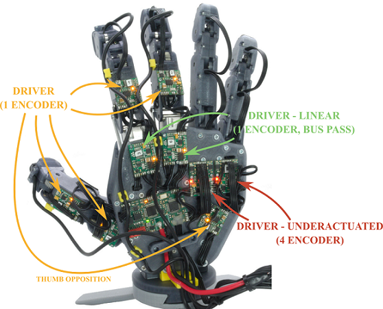

# PUT-Hand-Firmware-DRIVER

## About

PUT-Hand is an open-source project of a 5-finger anhomomorphic gripper. PUT-Hand is designed to manipulate wide range of object including elastic objects. PUT-Hand was designed using as many off-the-shelf parts and FDM 3D printing technology, with single elements requiring aluminium CNC machining or stainless steel turning. The [PUT-Hand repositories](https://github.com/puthand) include all parts necessary to recreate the proposed design: mechanical files, PCB design and firmware.

PUT-Hand-Firmware-DRIVER repository contains universal firmware (STM32L0) for all DRIVER units configurations. DRIVER is an execution unit and collects sensor data about itself (position, motor current). It does nor perform any position regulation tasks, it only serves as execution servomotor unit.

### DRIVER schematics

* <https://github.com/puthand/PUT-Hand-PCB/blob/master/PUT-Hand-DRIVER.PDF>
* <https://github.com/puthand/PUT-Hand-PCB/blob/master/PUT-Hand-DRIVER-LINEAR.PDF>
* <https://github.com/puthand/PUT-Hand-PCB/blob/master/PUT-Hand-DRIVER-UNDERACTUATED.PDF>

### DRIVER gerber files

* <https://github.com/puthand/PUT-Hand-PCB/tree/master/PUT-Hand-DRIVER>
* <https://github.com/puthand/PUT-Hand-PCB/tree/master/PUT-Hand-DRIVER-LINEAR>
* <https://github.com/puthand/PUT-Hand-PCB/tree/master/PUT-Hand-DRIVER-UNDERACTUATED>

## Tools

* SW4STM32 - System Workbench for STM32 - <http://www.openstm32.org>
* ST-LINK/V2 or compatible emulator
* STM32 ST-LINK Utility or other software for EEPROM values editing

## Usage

1. Open PUT-Hand-Firmware-DRIVER project using System Workbench for STM32.
2. Compile and upload firmware.
3. Using STM32 ST-LINK Utility edit EEPROM values:
    * at 0x08080000 memory address enter a unique system address for programmed DRIVER,
    * at 0x08080001 memory address enter a encoder count used for programmed DRIVER unit.

## Acknowledgments

* base64.c by Joe DF, MIT License - https://github.com/joedf/base64.c

## License

Unless stated otherwise, PUT-Hand project elements are licensed under a [Creative Commons Attribution-NonCommercial 4.0 International](https://creativecommons.org/licenses/by-nc/4.0/) (CC BY-NC 4.0). Accompanying firmware and software are licensed under a [MIT License](https://opensource.org/licenses/MIT).
